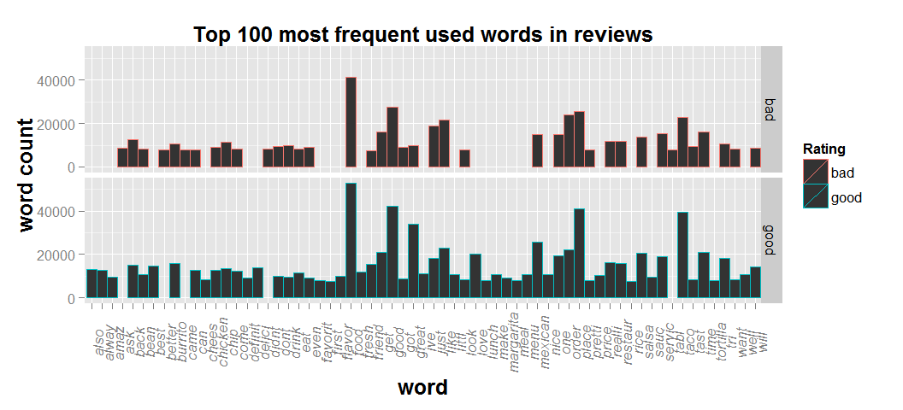

### Model

We run our model. It had 82.3% accuracy

```{r modelfit, echo=TRUE , warning=FALSE , cache=TRUE}
modelFit <- train(review_stars_bin~., data=training, method="glm")
predictions <- predict(modelFit, newdata=testing)
library(gmodels)
CrossTable(predictions, testing$review_stars_bin, 
           dnn=c("pridicted" , "Actual") , 
           prop.t=FALSE, prop.c=FALSE, prop.r=FALSE , prop.chisq = FALSE)
```


--- 

### _Result_


Our model identified  some words like _love, favorite, flavor , well, margaritta_ appear ONLY in "good" rating reviews. The word 'good' was used _two times_ more in "good" rating reviews compared to "bad" rating reviews.

```{r result, echo=FALSE , warning=FALSE , cache=FALSE , include = FALSE }
agg <- aggregate ( words[,c(1:332)] , by=list(words$review_stars_bin) , FUN=sum)
names(agg)[1] <- "Rating"
w <- melt ( agg, id.vars=c("Rating"))
w <- w [order(-w$value),]
ggp4 <- ggplot(head(w,100), aes(x=variable, y=value, stat="identity" , colour = Rating))
ggp4<- ggp4 + geom_bar(width=1, position = position_dodge(width=1))
ggp4 <- ggp4 + facet_grid(Rating ~ .)
ggp4 <- ggp4 + theme(axis.text.x = element_text(angle=90,face = "italic", size=10)) 
ggp4 <- ggp4 + theme(axis.title.x = element_text(face = "bold", size = 15)) 
ggp4 <- ggp4 + theme(axis.title.y = element_text(face = "bold", size = 15)) 
ggp4 <- ggp4 + theme(plot.title = element_text(face = "bold", size = 15)) 
ggp4 <- ggp4 + labs(title="Top 100 most frequent used words in reviews", 
                    y="word count", 
                    x="word")

png("assets/fig/result-1.png", width=480*2.2, height=240*2, res=120)
ggp4
dev.off()

```


<div style='text-align: center;'>
    
</div>

